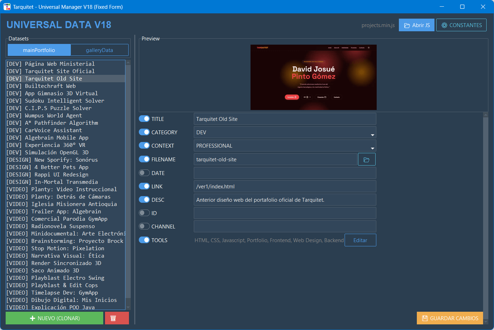

# 🗄️ Universal Portfolio DB Manager (v17)

> **Un gestor de base de datos visual (CMS local) en Python para editar archivos de configuración JavaScript de forma segura y automatizada.**

**Universal Portfolio DB Manager** es una herramienta de escritorio con interfaz gráfica avanzada diseñada para desarrolladores web que usan bases de datos estáticas en JavaScript (ej. Portafolios, Galerías). Permite leer, visualizar, editar y reescribir objetos y arrays complejos de JS sin tocar una sola línea de código, evitando errores de sintaxis y gestionando recursos visuales en tiempo real.

## ✨ Características Principales (Actualizado v17)

- **🧠 Parser JS Inteligente (V18):** Algoritmo de extracción nativo ultra estricto que elimina comentarios, ignora el texto plano (strings) para evitar falsos positivos y convierte objetos JavaScript en diccionarios de Python de forma no destructiva.
- **⚡ Recarga Dinámica y "Sticky Settings":** Al agregar un nuevo proyecto, el sistema clona automáticamente las configuraciones del proyecto anterior (Sticky Settings) para ahorrar tiempo. Además, guarda y recarga el archivo en segundo plano sin perder la selección actual.
- **🖼️ Gestor de Imágenes Robusto:** Buscador profundo que localiza imágenes locales automáticamente. Al agregar nuevas imágenes, el script normaliza rutas y crea las carpetas de destino automáticamente si no existen.
- **🏷️ Sistema de Tags Dinámico y Estricto:** Restringe menús desplegables (`Dropdowns`) solo a los campos necesarios (Categoría/Contexto) y recarga nuevas herramientas (Tools) en memoria instantáneamente al editarlas.
- **🛠️ Editor CRUD Visual y Multihilo:** Agrega, elimina, edita y reordena items con controles intuitivos que no congelan la interfaz. (Ahora compatible con la tecla `Enter` para guardado rápido).



---

## ⚙️ Requisitos e Instalación

El script cuenta con un **Auto-Instalador**. Al ejecutarlo por primera vez, intentará descargar automáticamente las dependencias necesarias.

**Requisitos del sistema:**

- Python 3.8 o superior.

**Dependencias (instaladas automáticamente):**

- `ttkbootstrap` (Interfaz gráfica moderna)
- `Pillow` (Procesamiento de previsualización de imágenes)
- `requests` (Carga de imágenes web)

### Ejecución

```bash
python 17_fixed_unnecesary_dropsowns.py

📖 Guía de Uso Rápida

    Cargar Base de Datos: Abre la aplicación y usa "Buscar Archivo" para seleccionar tu archivo de datos (cv_data.js).

    Selección de Lista: El programa detectará automáticamente todos los arrays disponibles. Selecciona uno en el menú lateral.

    Edición Rápida:

        Haz clic en cualquier proyecto para ver sus detalles.

        Modifica los campos y presiona Enter para aplicar cambios rápidos.

        Al hacer clic en [+ Nuevo Item], este heredará las categorías del último item seleccionado.

    Guardar: Haz clic en "💾 Guardar JS". El script actualizará el archivo original y recargará la vista sin que pierdas tu posición en la lista.

📈 Evolución del Proyecto (Changelog)

    v1-v4: Implementación inicial de UI (ttkbootstrap), previsualización de imágenes y transición al "Auto-Descubrimiento" de datos JS.

    v5-v9: Implementación de diálogos avanzados (MultiSelect y Autocomplete), manejo de constantes (CAT., T.) y corrección de congelamientos con Multithreading.

    v10-v12: Arreglos en el motor de scroll de la interfaz y recarga dinámica del JS post-guardado. Implementación del buscador profundo de imágenes locales.

    v13-v15: Integración de "Sticky Settings" (clonado de propiedades al crear nuevos items) y blindaje del Parser V18 para no leer strings como si fueran constantes de código.

    v16-v17 (Actual): Copia robusta de imágenes (creación automática de directorios). Restricción inteligente de Dropdowns para evitar menús innecesarios y guardado rápido con tecla Enter.

⚠️ Notas Técnicas

Este gestor está optimizado para la estructura específica del portafolio actual (detectando prefijos como CAT., CTX., T.). Si modificas las constantes desde la herramienta "Editor de Configuración", los cambios se reflejarán en la interfaz inmediatamente sin necesidad de recargar el archivo.
```
